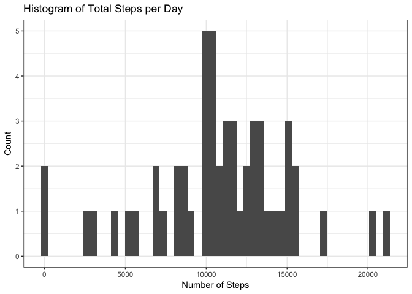
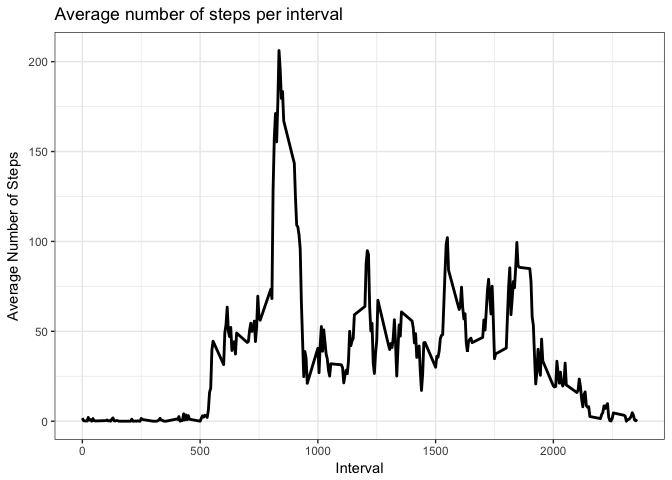
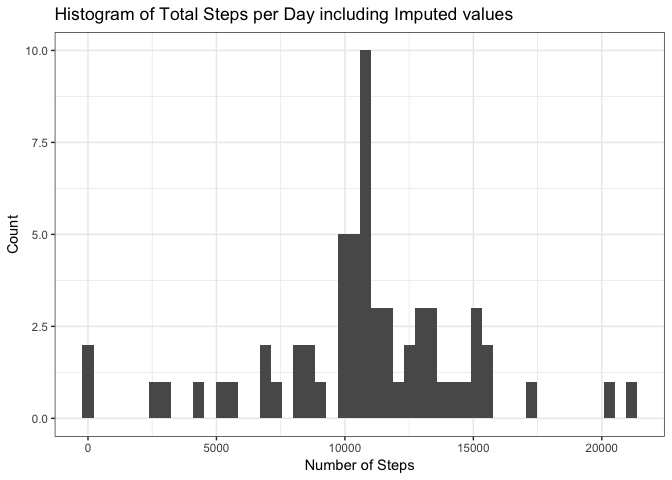

# Reproducible Research: Peer Assessment 1

The data that we are working with in this assigment comes from a personal activity monitoring device, such as a Fitbit, Fuelband, or Jawbone. Many people have these devices to improve their health. Additional information can be gathered from these data with proper processing.

The dataset was provided by the course GitHub, and contains counts of steps in 5 minute increments over a two month time.

## Loading and preprocessing the data

We read the data in and apply a few transformations to the data to make it more usable. 


```r
unzip("./activity.zip")
stepdata<-read.csv("./activity.csv")
stepdata$date<-as.Date(stepdata$date)
```

The only change we've made so far is to convert the ```date``` category to a 'Date' data type instead of character. Steps and Intervals are automatically imported as numeric types.

We'll make a data set that doesn't include ```NA``` values, in case we need it later.


```r
stepclean<-stepdata[complete.cases(stepdata),]
```

## What is mean total number of steps taken per day?

For this section we're looking at the total number of steps taken per day as a histogram.

First get the data broken up by day using ```split```, then form a list of daily sums with ```lapply``` and turn it into a vector with ```unlist```.


```r
byDay<-split(stepdata, stepdata$date)
dailysums<-lapply(byDay, function(x) colSums(x["steps"]))
dailysums<-unlist(dailysums)
```

With this ```dailysums``` vector, we can generate a histogram:

```r
library(ggplot2)
ggplot(,aes(dailysums))+
  geom_histogram(bins=50, na.rm = TRUE)+
  xlab("Number of Steps")+
  ylab("Count")+
  ggtitle("Histogram of Total Steps per Day")+
  theme_bw()
```

<!-- -->

We'll also usee this vector to calculate the mean and median of total steps per day and print it out:

```r
meansteps<-mean(dailysums, na.rm=TRUE)
mediansteps<-median(dailysums, na.rm=TRUE)
paste0("The mean steps per day is: ", meansteps, " and the median steps per day is ", mediansteps, ".")
```

```
## [1] "The mean steps per day is: 10766.1886792453 and the median steps per day is 10765."
```


## What is the average daily activity pattern?

To look at this section we'll have to average each of the intervals across each day (eg. the first interval of every day). 


```r
byinterval<-split(stepdata, stepdata$interval)
intervalmeans<-lapply(byinterval, function(x) colMeans(x["steps"], na.rm=TRUE))
stepmeans<-unlist(intervalmeans)
intervals<-unique(stepdata$interval)
```

Now to plot that data:


```r
ggplot(, aes(x=intervals, y=stepmeans)) + 
  geom_line(lwd=1)+
  xlab("Interval")+
  ylab("Average Number of Steps")+
  ggtitle("Average number of steps per interval")+
  theme_bw()
```

<!-- -->


We also need to discover the interval with the highest number of steps.

For this, we'll step back one to ```intervalmeans``` to get the name or label of the maximum using which.max to find the max.


```r
print(intervalmeans[which.max(intervalmeans)])
```

```
## $`835`
##    steps 
## 206.1698
```

So we see that interval 835 has the most steps on average, at 206.1698113.

## Imputing missing values
Many values are missing. We'll take a look at how many before we try to impute the missing data. 


```r
print(sum(is.na(stepdata$steps)))
```

```
## [1] 2304
```

With that much missing data, imputing values is important if we break the data apart for deeper analysis. First, replace ```NA``` with the average in each interval. Then rbind the interval devided set back to one dataframe.


```r
for (i in 1:length(byinterval)) {
  byinterval[[i]]$steps[is.na(byinterval[[i]]$steps)]<-mean(byinterval[[i]]$steps, na.rm=TRUE)
}
imputesteps<-do.call("rbind",byinterval)
```

The function uses ```do.call``` to help the list explode to the dataframes inside. 

Now, we'll break the impute set back up by day and sum each day again.


```r
imputeDay<-split(imputesteps, imputesteps$date)
imputedaysums<-lapply(imputeDay, function(x) colSums(x["steps"]))
imputedaysums<-unlist(imputedaysums)
```

With this ```imputedaysums``` vector, we can generate a histogram:

```r
ggplot(,aes(imputedaysums))+
  geom_histogram(bins=50)+
  xlab("Number of Steps")+
  ylab("Count")+
  ggtitle("Histogram of Total Steps per Day including Imputed values")+
  theme_bw()
```

<!-- -->

We'll also usee this vector to calculate the mean and median of total steps per day and print it out:

```r
meanimputesteps<-mean(imputedaysums, na.rm=TRUE)
medianimputesteps<-median(imputedaysums, na.rm=TRUE)
paste0("The imputed mean steps per day is: ", meanimputesteps, " and the imputed median steps per day is ", medianimputesteps, ".")
```

```
## [1] "The imputed mean steps per day is: 10766.1886792453 and the imputed median steps per day is 10766.1886792453."
```

```r
paste0("The original mean was: ",meansteps, " and the median was: ",mediansteps,".")
```

```
## [1] "The original mean was: 10766.1886792453 and the median was: 10765."
```

As expected, the mean didn't change, but the median did.

## Are there differences in activity patterns between weekdays and weekends?

We can look at differences between weekday and weekend results, to see if there's a trend that arises. 

First, lets add weekday info to the data frame:

```r
weekend<-c("Saturday", "Sunday")
stepdata_days<-cbind(stepdata, weekdays(stepdata$date) %in% weekend)
colnames(stepdata_days)<-c(colnames(stepdata), "weekend")
stepdata_days$weekend<-as.factor(stepdata_days$weekend)
```

Now, as before, split the set by interval, but also by weekend/weekday:

```r
byWeekIntervals<-split(stepdata_days, stepdata_days$weekend)[[1]]
byWeekIntervals<-split(byWeekIntervals, byWeekIntervals$interval)
weekdaymeans<-data.frame(unlist(lapply(byWeekIntervals, function(x) colMeans(x["steps"], na.rm=TRUE))))

byWeekendIntervals<-split(stepdata_days, stepdata_days$weekend)[[2]]
byWeekendIntervals<-split(byWeekendIntervals, byWeekendIntervals$interval)
weekendmeans<-data.frame(unlist(lapply(byWeekendIntervals, function(x) colMeans(x["steps"], na.rm=TRUE))))
```

Stitch the two back together:

```r
byWeekIntervals<-cbind(intervals, weekdaymeans, rep("Weekday", length(intervals)))
colnames(byWeekIntervals)<-c("interval", "steps", "weekend")
byWeekendIntervals<-cbind(intervals, weekendmeans, rep("Weekend", length(intervals)))
colnames(byWeekendIntervals)<-c("interval", "steps", "weekend")
weeklyIntervals<-rbind(byWeekIntervals, byWeekendIntervals)
weeklyIntervals$weekend<-as.factor(weeklyIntervals$weekend)
```

Now that the data is prepared, we can make a plot. The assignment calls for a specific plot from lattice, so that's what we'll make.


```r
library(lattice)
xyplot(steps ~ interval | weekend, data=weeklyIntervals, 
       layout = c(1,2), 
       type = "l", 
       main = "Average number of steps in each interval, by type of day",
       xlab = "Interval",
       ylab = "Number of Steps")
```

<!-- -->
